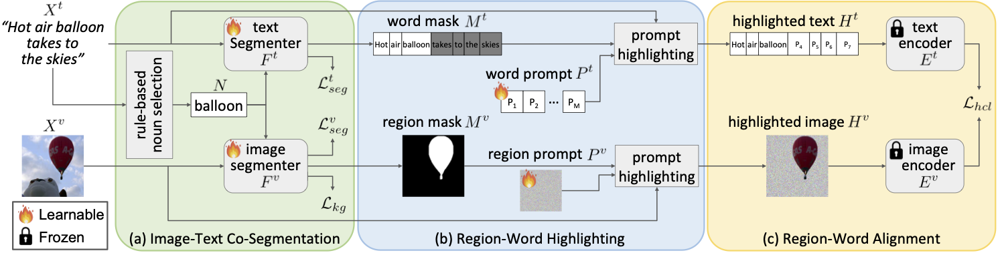

[🎉 2024/02/26 This work has been accepted by CVPR 2024!]

This paper addresses text-supervised semantic segmentation, aiming to learn a model capable of segmenting arbitrary visual concepts within images by using only image-text pairs without dense annotations. Existing methods have demonstrated that contrastive learning on image-text pairs effectively aligns visual segments with the meanings of texts.

We notice that there is a discrepancy between text alignment and semantic segmentation: A text often consists of multiple semantic concepts, whereas semantic segmentation strives to create semantically homogeneous segments. To address this issue, we propose a novel framework, Image-Text **Co**-**De**composition (**CoDe**), where the paired image and text are jointly decomposed into a set of image regions and a set of word segments, respectively, and contrastive learning is developed to enforce region-word alignment.

To work with a vision-language model, we present a prompt learning mechanism that derives an extra representation to highlight an image segment or a word segment of interest, with which more effective features can be extracted from that segment.

Comprehensive experimental results demonstrate that our method performs favorably against existing text-supervised semantic segmentation methods on six benchmark datasets.