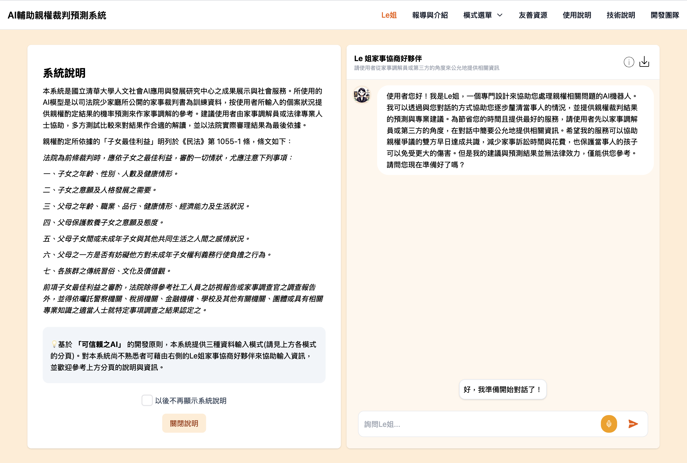
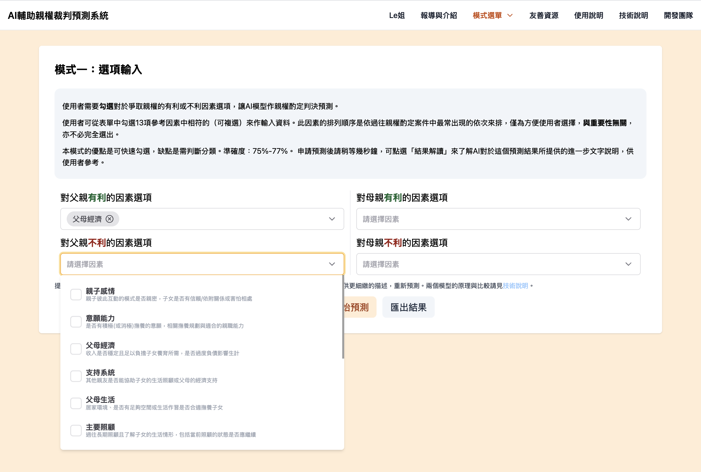
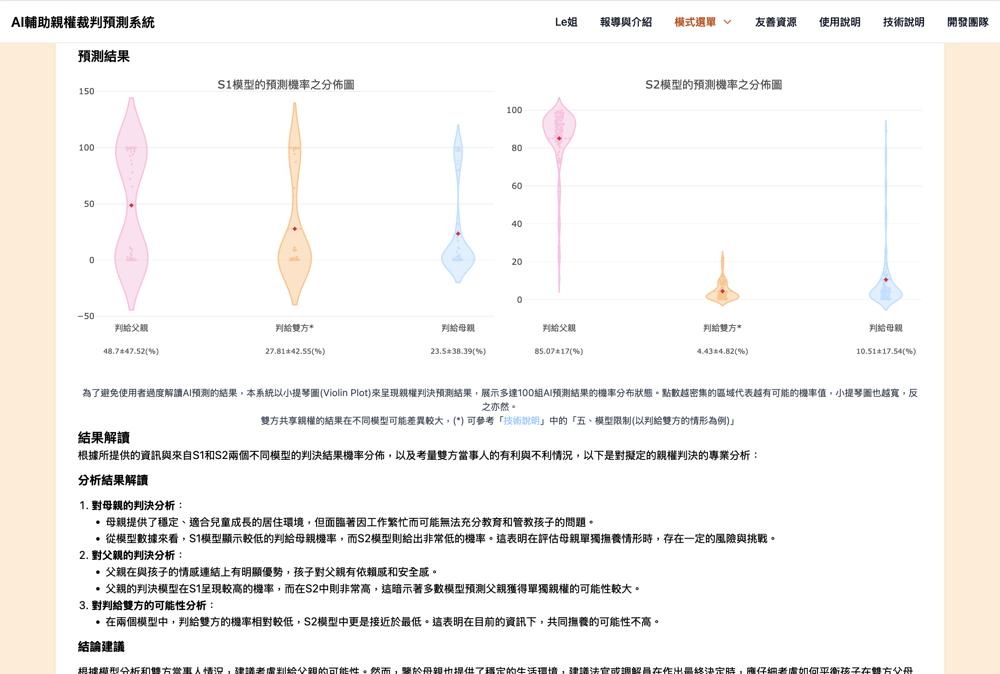


CustodiAI



 Github Link


**CustodiAI: A System to Predict the Outcome of Child Custody Cases**

**AI輔助親權裁判預測系統**

CustodiAI uses artificial intelligence to predict child custody outcomes in family law cases, providing data-driven insights for legal professionals and individuals involved in custody disputes. Endorsed by the [Taiwan Shilin District Court and the Taiwan Judicial Yuan](https://www.judicial.gov.tw/tw/cp-1888-1119620-77ae5-1.html), CustodiAI is actively used by social workers to assist parents in understanding their strengths and weaknesses in custody disputes, thereby increasing opportunities for settlement. The platform was designed and developed by the [Artificial Intelligence for Fundamental Research (AIFR) Group](http://www.phys.nthu.edu.tw/~aicmt/index.html), led by [Prof. Daw-Wei Wang](https://phys.site.nthu.edu.tw/p/406-1335-58679,r3581.php?Lang=en) at National Tsing-Hua University (NTHU).

During Summer 2024, I participated in this meaningful and engaging project.

## My Responsibility

- Completely rebuilt the frontend using Vite and Vue.js, significantly reducing the project build time from 1 minute **to under 5 seconds**.
- Developed an LLM-powered chatbot leveraging **prompt engineering** to streamline data input and **few-shot prompting** techniques to enhance machine learning data analysis.
- Streamlined the project architecture by adopting Vue Single File Components (SFCs) and utilizing Pinia for efficient global state management.
- Redesigned the user interface, employing TailwindCSS to ensure responsive and accessible design across multiple platforms.
- Integrated markdown rendering for simplified content editing and PDF exporting to enhance user convenience.

## Features and Screenshots
The homepage of the platform, featuring an intuitive Chatbot UI for easy access and clear disclaimers.

Various parent-child relationship attributes can be selected based on individual circumstances and then inputted into the ML model to predict custody outcomes, depending on the selected prediction mode.

Model predictions, complete with summarizations and detailed analyses provided by LLMs, aid users in making informed custody-related decisions.
