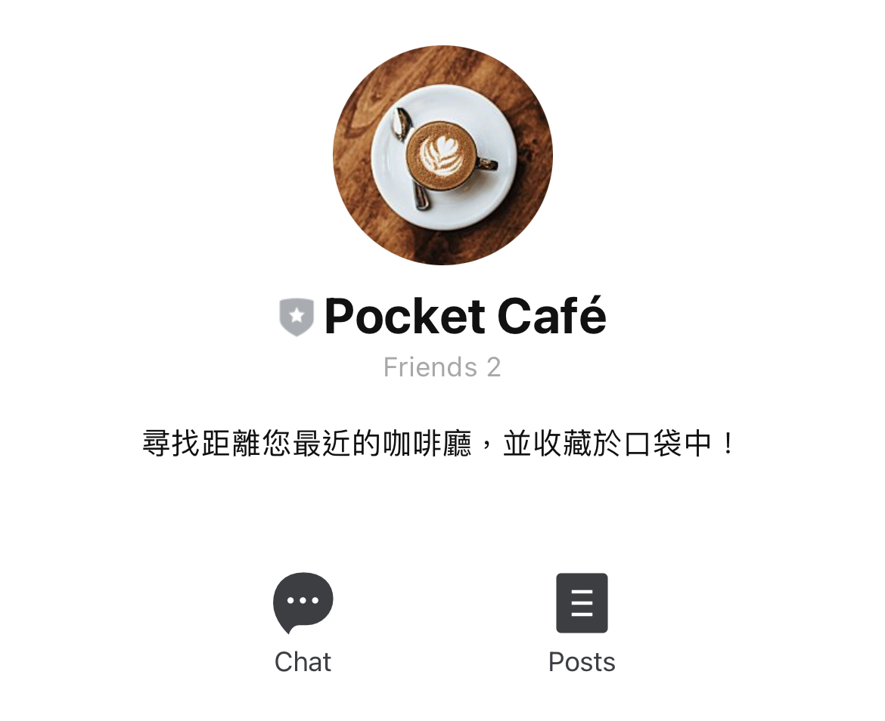
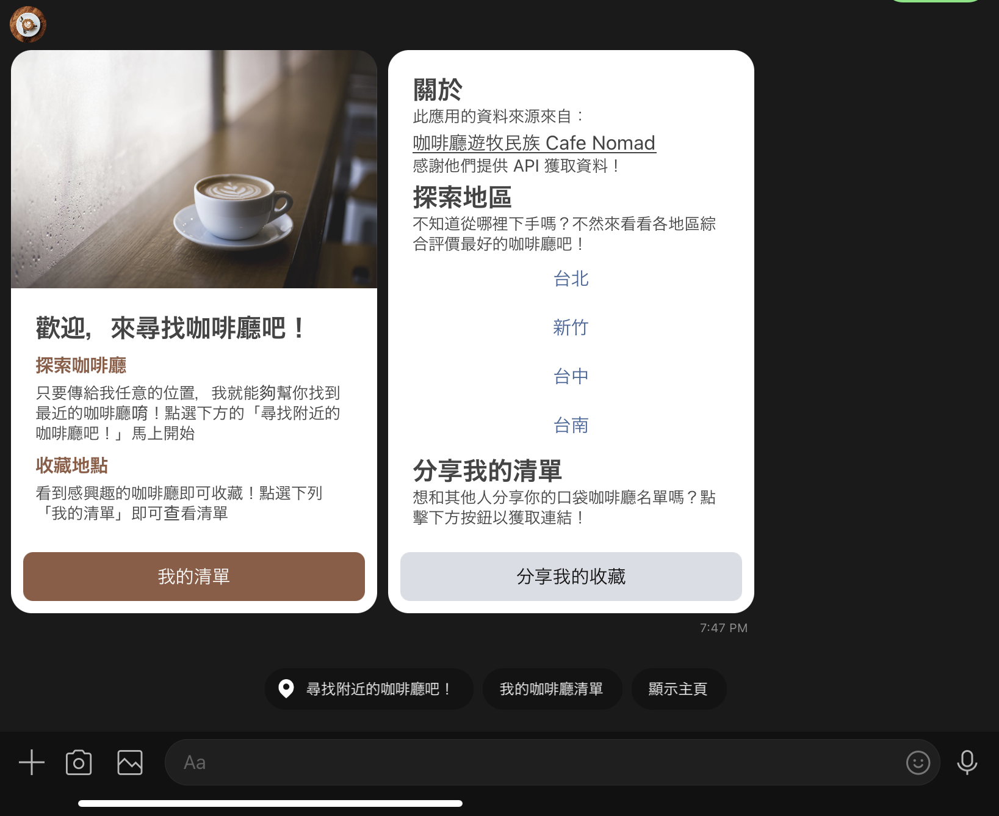
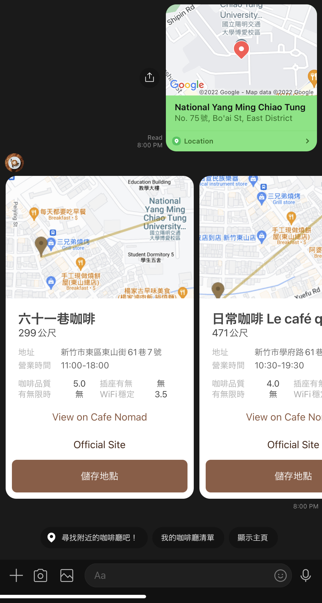
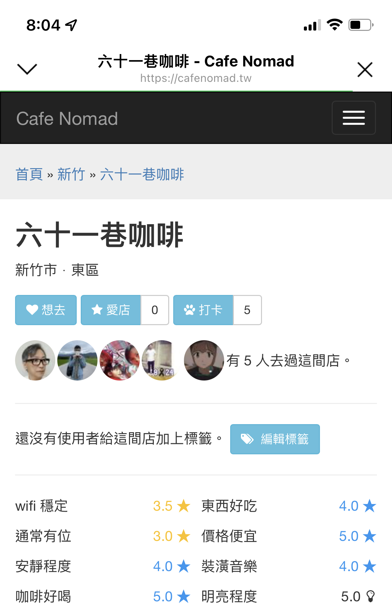
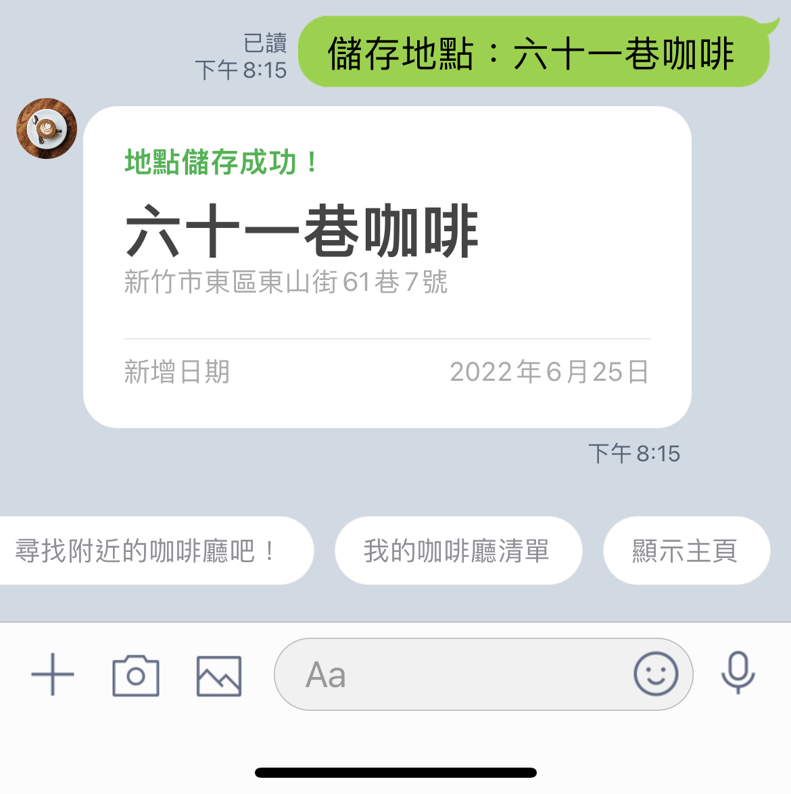
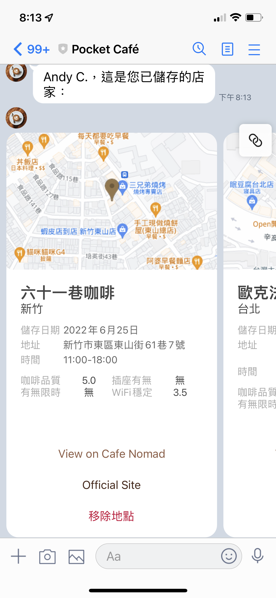
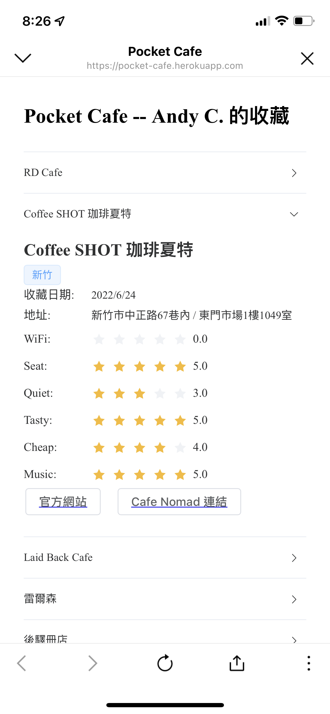


 Github Link


## Project Summary

Pocket Café is a LINE Bot application I developed while living in Taiwan that helps users find, save, and share great cafés. The app uses crowdsourced data from [Cafe Nomad](https://cafenomad.tw/) to show users the nearest cafés to their location, complete with ratings, amenities information, and navigation directions. Users can save their favorite cafés to a personal collection and share this list with friends through a companion website.

Built with Node.js, PostgreSQL, and the LINE Messaging API, this project combines my passion for coffee with practical functionality to solve a common problem: finding quality cafés efficiently. The app takes advantage of LINE's widespread usage in Taiwan to create a seamless user experience without requiring new app downloads.

> Note: All interface elements shown in screenshots are in Traditional Chinese, as the application was developed specifically for Taiwan users.

## 1. Motivation

**Starting Point: Coffee and Café**

As a former core member of a [coffee club](https://www.facebook.com/NCTUcoffee) during undergrad, I really love drinking coffee.

Besides brewing coffee at home and at the club, I also like to explore different **cafés** from time to time to discover new flavors, chat with shop owners, and exchange brewing and roasting techniques. While enjoying coffee, I also choose to stay in cafés to study or work, enjoying my personal time. So when I don't have classes, I like to adventure to a café **I've never been to before**, tasting different flavors. If I find a good one, I'll share it with my friends from the coffee club, or recommend it to other interested friends nearby.

Apart from drinking coffee, other people's motivations for finding cafés might be simpler than mine: in their busy lives, they might want to change their environment to work or study, or just want to relax in a café and read a book. For these people, the **café** itself is the primary purpose, and whether the coffee is good isn't as important.

Although our motivations differ, we all have a common goal — we want to be able to systematically find good cafés.

**Objective**

Therefore, creating an application that can **1. quickly and 2. conveniently obtain information about cafés** became my **primary goal**. If it could also include features like **3. saving and bookmarking locations** and **4. sharing**, that would be even better.

**Similar Products**

At this point, some might think: using Google Maps and typing "coffee" would accomplish this. However, although Google Maps is rich in information, it wouldn't be my usual way to "find" cafés. This is because Google Maps often tends to recommend restaurants and casual dining places that serve coffee, rather than actual cafés. Using Google Maps to systematically find "real" cafés still presents certain challenges.

So I turned to look for a dataset or website that catalogs cafés across Taiwan (which is a better solution than writing a crawler to scrape through all the "cafés" on Google Maps).

**Data Source**

While searching for a **data source**, I found the [Cafe Nomad](https://cafenomad.tw/) website, which uses crowdsourcing to catalog over 3,000 cafés across Taiwan. It provides user ratings for various café metrics, including coffee quality, availability of power outlets, time limits, WiFi access, etc. Additionally, it includes the official website URLs of shops and their coordinates. After researching, I found that this website's data perfectly matched my needs.

I believe the problems with this website are:

Since it's a standalone website (just a website, no app) and requires login to do more things (like bookmarking and saving locations), and because it displays 100-200 cafés at once, it's difficult for users to choose among them. Therefore, I decided to make some improvements based on the data this website has.

**Final Idea**

After brainstorming and exploring ideas, I eventually developed a LINE Bot and a complementary website that can:

1. Return information about the 7 cafés closest to the user's provided location
2. Explore the highest-rated cafés in each county/city
3. Save and delete favorite cafés, all within LINE
4. Share the user's collection list with others via a website format

> **Note:** This project was developed while I was based in Taiwan, where LINE is the dominant messaging app. Almost everyone in Taiwan has a LINE account, making it the perfect platform for a widely accessible application without requiring users to download something new.

Since everyone has LINE, this improved upon the problem of needing a special account. Furthermore, since everything can be done within LINE, convenience is greatly enhanced.

The following details the features and development process.

## 2. Application Description

**Pocket Café: Your favorite cafés in your pocket!**



### **Application Overview**

Just open LINE, add Pocket Café as a friend, and you can find information about the cafés closest to you. When you see a shop you like, you can also save it and share it with your friends.

The main features, as mentioned in the first section, are described again here:

1. After the user provides their location, return information about the 7 cafés closest to the user's location
2. Explore the highest-rated cafés in each county/city
3. Save and delete favorite cafés, all within LINE
4. Share the user's collection list with others via a website format

LINE Bot QR Code: Feel free to add as a friend!


Bot ID: @973cexqv

### **Feature Overview**

**1. Main Page**



Describes the various features of the application; you can click any section of the card to continue.

**2. Find Nearby Cafés**



By sending a location to Pocket Cafe, the Bot will return the 7 cafés closest to the location along with the following information:

- Distance: How far the café is from the given location
- Address, operating hours
- Map information: Click the map thumbnail to open Google Maps navigation; the map thumbnail shows the shortest straight-line distance between the starting point and destination

 

- Ratings for various café features
- View On Cafe Nomad: More detailed information (links to external website)


    
- Official Site: If there's official website information, you can also visit it

**3. Save Cafés**

- Click "Save Location" to bookmark a café.



- Click "My Café List" to view all saved cafés



- Click "Remove Location" to delete a café from your collection list

**4. Explore the Highest-Rated Cafés by Region**

You can explore various regions: Hsinchu, Taipei, Tainan, Kaohsiung, based on the top ten cafés ranked by overall ratings on Cafe Nomad.

**5. Share Your Saved Cafés**

Click "Share My Collection" on the main page to **generate a webpage** of your saved café list, through which you can share your favorite cafés with friends.



Example: [https://pocket-cafe.herokuapp.com/lists/U18117193e4b725a34c17dbe69ebca882](https://pocket-cafe.herokuapp.com/lists/U18117193e4b725a34c17dbe69ebca882)

### **Technical Architecture**
| | |
|:---:|:---:|
|  |  |
|  |  |
|  |  |

**Front-end:**

[LINE messaging API](https://developers.line.biz/en/reference/messaging-api/) for interacting with LINE

[Google Maps API](https://developers.google.com/maps/documentation/maps-static/) to generate static map images

**Front-end Website:**

Website written in [Nuxt.js](https://nuxtjs.org/), hosted on Heroku

**Backend:** hosted on Heroku

Node.js and express.js for server management

[node-postgres](https://node-postgres.com/) for interfacing with PostgreSQL

**Database:** PostgreSQL, hosted on Amazon RDS


**Github repo:**

Frontend: [https://github.com/newb1er/PocketCafeListWeb](https://github.com/newb1er/PocketCafeListWeb)

Kudos to my friend 簡右群 for helping me set up the front-end framework!

Backend: [https://github.com/andyrochi/PocketCafeList](https://github.com/andyrochi/PocketCafeList)

For both the LINE bot server and backend API

We primarily deployed the server handling all requests on Heroku's service, which is written in nodejs. The server receives requests from both the front-end pages and the LINE messaging API, and then either retrieves data from the database or responds directly based on the request.

## 3. Data Sources and Collection Methods

**Café Information**

As mentioned earlier, Cafe Nomad's data is perfect for our needs.


And it happens to provide an [API](https://cafenomad.tw/developers/docs/v1.2), so we can directly obtain data from the API and store it in our database.

Currently, there are 3,446 cafés.

After analysis, the fields include:

- `id` - a UUID: `string`
- `name` - store name: `string`
- `wifi` - wifi stability: `float`, value from 0.0 to 5.0
- `seat` - usually has seats: `float`, value from 0.0 to 5.0
- `quiet` - quietness level: `float`, value from 0.0 to 5.0
- `tasty` - coffee quality: `float`, value from 0.0 to 5.0
- `cheap` - price affordability: `float`, value from 0.0 to 5.0
- `music` - decor and music: `float`, value from 0.0 to 5.0
- `address` - address: `string`
- `latitude` - `latitude`
- `longitude` - `longitude`
- `url` - official website: `string`
- `limited_time` - time limit: `string`, yes/maybe/no/null
- `socket` - many outlets: `string`, yes/maybe/no/null
- `standing_desk` - can work standing: `string`, yes/no/null
- `mrt` - metro station: `string`, information about nearby metro stations
- `open_time` - operating hours: `string`

Based on my understanding, store information doesn't change too quickly, so there's no need to update frequently; updating about once a week is sufficient.

Therefore, we first built a table based on the field information. Then, using `node.js`, we requested data from the API and used `node-postgres` to `INSERT` each field into the database.

The SQL command is:

```sql
INSERT INTO cafe(id,name,city,wifi,seat,quiet,tasty,cheap,music
								,url,address,latitude,longitude,limited_time,socket,standing_desk,mrt,open_time) 
						VALUES (....);
```

**User Information**

Using the LINE Messaging API, every message sent by a user includes a userId, allowing us to identify the sender, but we cannot know the user's name.

LINE has another API that can obtain the user's name, so when a user first adds the LINE Bot as a friend, we use this API to get the user's information and store it along with the userid in the user table.

**User's Collection List**

Users will naturally add and delete data while using our Bot, so we just need to set up the table first.

## 4. Database Schema

**ERD generated by pgAdmin:**


Tables:
- `cafe`
- `user`
- `saved_location`

**Table 1: cafe**

This table is mainly related to cafés, and all attributes are functionally dependent on id (Primary Key). Additionally, since almost all the queries I can think of request all information at once, I didn't do any further normalization.

This table is relatively simple. Based on the nature of the data, I stored the content in the following way, adding constraints like NOT NULL and Primary key as appropriate.

*Table creation:*

```sql
CREATE TABLE cafe(
   id            VARCHAR(36) NOT NULL PRIMARY KEY
  ,name          VARCHAR(50)
  ,city          VARCHAR(10) NOT NULL
  ,wifi          NUMERIC(3,1) NOT NULL
  ,seat          NUMERIC(3,1) NOT NULL
  ,quiet         NUMERIC(3,1) NOT NULL
  ,tasty         NUMERIC(3,1) NOT NULL
  ,cheap         NUMERIC(3,1) NOT NULL
  ,music         NUMERIC(3,1) NOT NULL
  ,url           VARCHAR(300)
  ,address       VARCHAR(100)
  ,latitude      NUMERIC(11,8) NOT NULL
  ,longitude     NUMERIC(12,8) NOT NULL
  ,limited_time  VARCHAR(5)
  ,socket        VARCHAR(5)
  ,standing_desk VARCHAR(3)
  ,mrt           VARCHAR(250)
  ,open_time     VARCHAR(300)
);
```

*Constraints:*

Primary Key: `id`

*Indexing:*

Since some of our queries focus on specific cities, I added an index for city.

Since the primary key in postgresql is indexed by default and treated as a clustered index, I didn't make any additional adjustments.

**Table 2: user**

This table is mainly used to store user names. Since `userid` is unique, I set it as the primary key. User names are stored as needed, without any constraints.

**Table 3: saved_location**

saved_location is used to record user lists, with the most common use being natural joins with other tables. Constraints information is as follows:

### Table creation

```sql
CREATE TABLE public.saved_location
(
    userid character varying(100) NOT NULL,
    id character varying(36) NOT NULL,
		add_date TIMESTAMPTZ NOT NULL,
    CONSTRAINT "PRIMARY_KEY" PRIMARY KEY (userid, id),
    CONSTRAINT "user" FOREIGN KEY (userid)
        REFERENCES public."user" (userid) MATCH SIMPLE
        ON UPDATE NO ACTION
        ON DELETE NO ACTION
        NOT VALID,
    CONSTRAINT cafe FOREIGN KEY (id)
        REFERENCES public.cafe (id) MATCH SIMPLE
        ON UPDATE NO ACTION
        ON DELETE NO ACTION
        NOT VALID
);
```

### Constraints

**Primary key constraints**

- `CONSTRAINT "PRIMARY_KEY" PRIMARY KEY (userid, id)`

**Foreign key constraints**

- `CONSTRAINT "user" FOREIGN KEY (userid) REFERENCES public."user" (userid)`
- `CONSTRAINT cafe FOREIGN KEY (id) REFERENCES public.cafe (id)`

### Indexing

- The primary key indexing is already beneficial for our query purposes

## 5. Application Functions and Related SQL Queries

**5-1. Fetching 7 nearest cafes given a location**

The first issue to resolve is how to calculate distance. Here, I defined the following function in pgAdmin to calculate distance:

```sql
CREATE OR REPLACE
FUNCTION calculate_distance(lat1 float, lon1 float, lat2 float, lon2 float, units varchar)
RETURNS float AS $dist$
DECLARE
	dist float = 0;
	radlat1 float;
	radlat2 float;
	theta float;
	radtheta float;
  BEGIN
      IF lat1 = lat2 AND lon1 = lon2
          THEN RETURN dist;
      ELSE
          radlat1 = pi() * lat1 / 180;
          radlat2 = pi() * lat2 / 180;
          theta = lon1 - lon2;
          radtheta = pi() * theta / 180;
          dist = sin(radlat1) * sin(radlat2) + cos(radlat1) * cos(radlat2) * cos(radtheta);

          IF dist > 1 THEN dist = 1; END IF;

          dist = acos(dist);
          dist = dist * 180 / pi();
          dist = dist * 60 * 1.1515;

          IF units = 'K' THEN dist = dist * 1.609344; END IF;
          IF units = 'N' THEN dist = dist * 0.8684; END IF;

          RETURN dist;
      END IF;
  END;
```

If the parameter 'K' is passed in, the function output will be the distance between two sets of coordinates, calculated in kilometers.

We can then use the following SQL query to get the 7 nearest cafés:

`$1, $2` are parameters passed by node-postgres, representing the current latitude and longitude.

```sql
SELECT id, 
      name,
      address, 
      open_time, 
      url,
      tasty::float,
      socket,
      limited_time,
      wifi::float,
      latitude::float, 
      longitude::float,
      calculate_distance($1, $2, latitude, longitude, 'K') as distance
FROM cafe
ORDER BY distance
limit 7
```

**5-2. New user added as LINE friend, adding user to database**

After a new user joins, our database needs to be updated.

We'll first cache some local variables in the node.js environment to determine if this user has appeared before. If they have, we won't proceed with the query.

But if they haven't, there are two possibilities:

1. They're a new user, not yet added to the database
2. The backend restarted, the cache has no data for this user, but the user data is already in the database

Both situations can be resolved with the following SQL query:

```sql
INSERT INTO "user"(userid, displayname)
  VALUES($1, $2)
  ON CONFLICT(userid) DO NOTHING
```

When there's a conflict with the primary key (usually a unique constraint conflict), we do nothing.

**5-3. Showing the username in the webpage**


Since the webpage isn't in the LINE environment, we need to separately retrieve user data from the database.

Here, we pass the userid from the LINE Bot to the frontend webpage as a parameter, and then the frontend queries the backend and database to get the corresponding information.

```sql
SELECT * FROM "user" WHERE userid = $1
```

**5-4. Returning a user's cafe list**

To get a user's list, we just need to filter the `rows` in saved_location by `userid`, and then `natural join` with the cafe table.

Here, I want to sort by the time added in descending order.

```sql
WITH saved AS
  (SELECT *
  FROM "saved_location"
  WHERE userid = $1)
  SELECT *
FROM saved NATURAL JOIN cafe
ORDER BY add_date DESC
```

This query is suitable for both **generating a shared collection webpage** and listing saved cafés in LINE.

**5-5. Adding a new café to saved list**

Following the same logic as adding a new user, to avoid conflicts, we just need to DO NOTHING.

```sql
INSERT INTO "saved_location"(userid, id, add_date)
  VALUES($1, $2, $3)
  ON CONFLICT DO NOTHING
```

**Miscellaneous details:**

After clicking to save a café, since the backend receiving the request only has the café's id, we need to query the database again to get more information about the café (such as café name, address, etc.) to provide a better user experience:


The command for querying again is as follows:

```sql
SELECT * FROM cafe WHERE id = $1
```

**5-6. Deleting a café from saved list**

We only need the userid and the café's id to lock in a unique row (because it's the primary key), so the following query accomplishes our goal:

```sql
DELETE FROM saved_location
WHERE userid = $1 AND id = $2
```

**5-7. Obtaining 10 cafes with the best overall score in a city**

Sorting cafés from highest to lowest overall rating, and filtering by specific city, the query code is as follows:

```sql
SELECT *, wifi+seat+quiet+tasty+cheap+music AS total
FROM cafe
WHERE city=$1
ORDER BY total DESC
LIMIT 10
```

## 6. Conclusion

Through this project, I experienced the process from conceptualizing a project to gradually shaping it, and finally implementing it. Combining knowledge of the following:
* AWS RDS and databases learned in an academic setting
* constantly looking up documentation to piece together a LINE Bot
* researching how to use the Google Maps API to generate maps
* writing a backend with node.js and integrating it with PostgreSQL
* creating a frontend webpage with Vue
* deploying all services to Heroku/AWS for people to use

it's really quite a satisfying accomplishment.