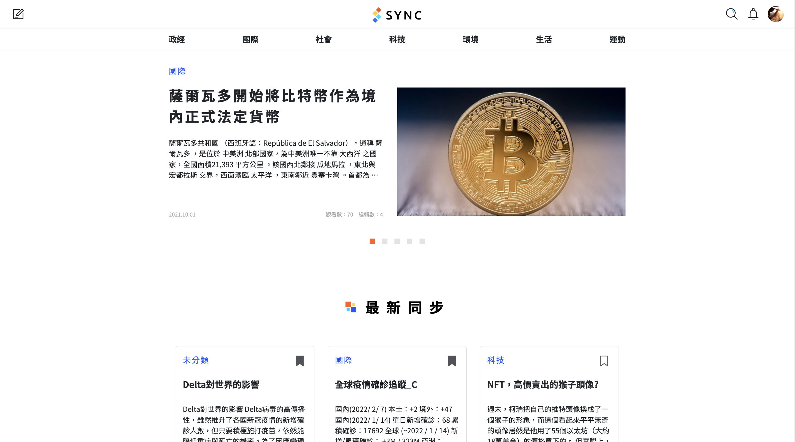


 Github Link


**SYNC - Crowdsourcing Platform for News Co-Editing 新聞懶人包共編平台**

This project, funded by the [National Science and Technology Council (NSTC), Taiwan](https://www.nstc.gov.tw/?l=en) (previously Ministry of Science and Technology, MOST), aims to provide a platform where audiences can read and collaboratively edit news articles, with a primary focus on **news events**. It is a research platform under the Mobile and Ubiquitous Interaction Laboratory under the supervision of Professor [Yung-Ju (Stanley) Chang](https://people.cs.nycu.edu.tw/~armuro/).

## Motivation

In today's fast-paced world, people receive information from a variety of sources, including social media (e.g., Facebook, YouTube, Instagram), news agencies, and television. However, most audiences tend to consume news regularly from just a "single source." As is widely known, each news source may have its own biases, perspectives, and political interpretations.

When people rely on just one news source, they often develop a skewed understanding of events. We call this being "out-of-sync" – a situation where different people have dramatically different perspectives on the same news story, leading to disagreements as individuals become attached to their own version of events.

To address this issue, we created **SYNC - Crowdsourcing Platform for News Co-Editing**, a platform where everyone has the right and opportunity to read and edit news articles. It aims to provide a more balanced and comprehensive range of views to inform all users.

## My Responsibility

- I served as the lead developer for **SYNC** from 2021-2022, primarily focusing on the frontend web interface, and continued maintaining the project through the end of 2023. The frontend is built using Vue.js, Vuex, and BootstrapVue, with the core editor powered by [Tiptap](https://tiptap.dev/).
- Participated in weekly meetings, collaborating with other developers and UI/UX designers to update progress and discuss new features.
- Developed Python scripts and basic scheduling mechanisms to crawl news articles from 10+ sources, including 中央社 (CNA), 自由時報 (The Liberty Times), 中國時報 (ChinaTimes), and store them in a MongoDB backend.
    - A further iteration of the crawler was designed collaboratively with my colleague, focusing on utilizing task schedulers and protocol buffers to enable continuous, low-overhead database updates.
- As Large Language Models gained prominence in 2023, I explored ways to integrate LLM-generated summaries into the platform to improve user experience. To achieve this, I designed a **retrieval augmented generation framework** leveraging **LlamaIndex** and **ChromaDB**, which significantly enhanced editorial efficiency.
- I mentored three newcomers in redesigning the backend architecture using Nest.js, improving modularity and scalability.

## Features and Screenshots
The homepage of the platform.

The article reading interface.

The article editing interface.

Comparing different versions of an article.

Personal page
