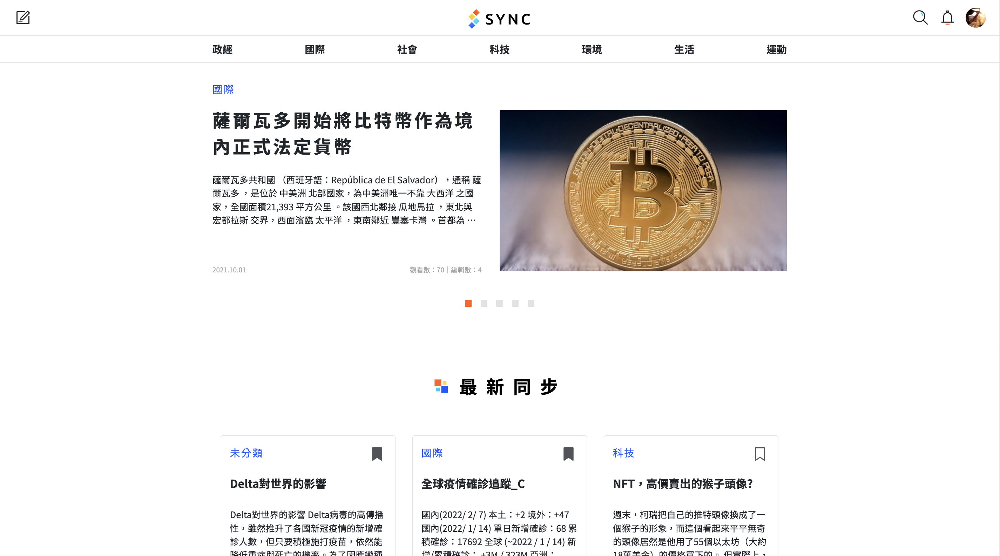
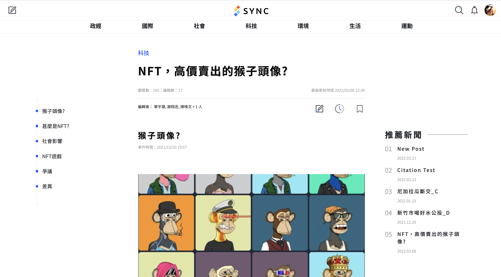
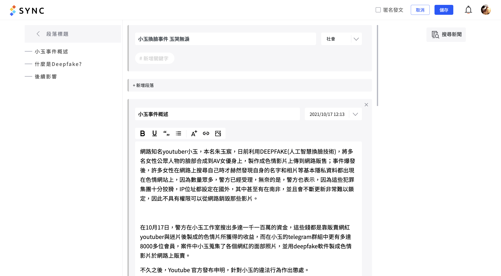
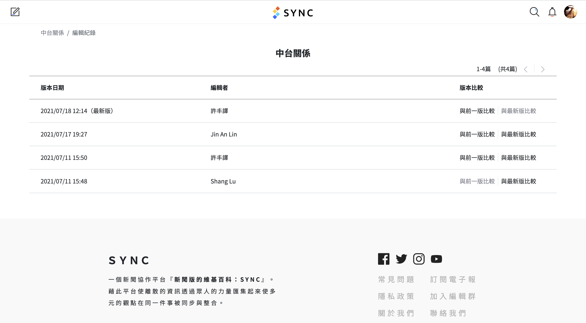
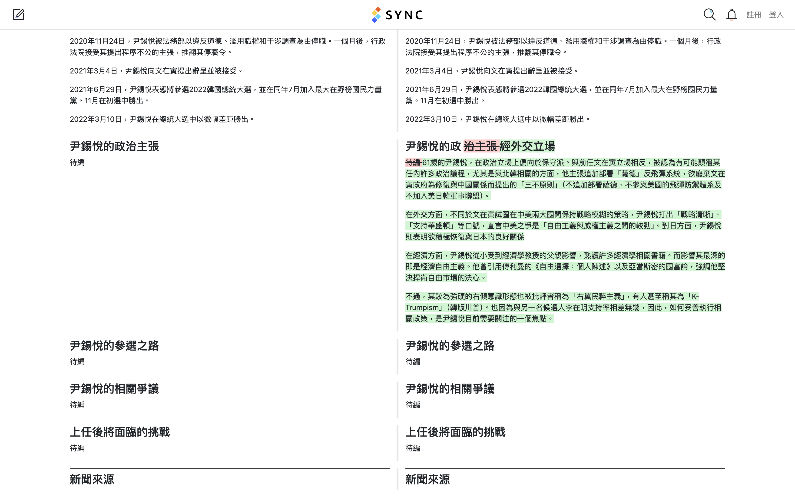
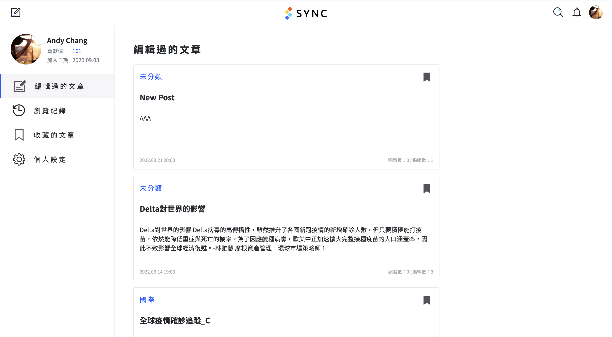

**SYNC - Crowdsourcing Platform for News Co-Editing 新聞懶人包共編平台**

This project, funded by the National Science and Technology Council (NSTC), Taiwan (previously Ministry of Science and Technology, MOST), aims to provide a platform where audiences can read and collaboratively edit news articles, with a primary focus on **news events**.

## Motivation

In today’s fast-paced world, people receive information from a variety of sources, including social media (e.g., Facebook, YouTube, Instagram), news agencies, and television. However, most audiences tend to consume news regularly from just a “single source.” As is widely known, each news source may have its own biases, perspectives, and political interpretations. Relying solely on one source can lead to a skewed understanding of an event, resulting in what we define as being “out-of-sync.” This divergence in understanding may cause disputes, as people cling to their own version of the story.

To address this issue, we created **SYNC - Crowdsourcing Platform for News Co-Editing**, a platform where everyone has the right and opportunity to read and edit news articles. It aims to provide a more balanced and comprehensive range of views to inform all users.

## My Responsibility

- I am the lead developer of **SYNC** during 2021-2022, where I mainly focus on the frontend web interface and continued to maintain the project until the end of 2023. The frontend is built using Vue.js, Vuex, and BootstrapVue, with the core editor powered by [Tiptap](https://tiptap.dev/).
- Participated in weekly meetings, collaborating with other developers and UI/UX designers to update progress and discuss new features.
- Developed Python scripts and basic scheduling mechanisms to crawl news articles from 10+ sources, including 中央社 (CNA), 自由時報 (The Liberty Times), 中國時報 (ChinaTimes), and store them in a MongoDB backend.
    - A further iteration of the crawler was designed by both me and my colleague, focusing on utilizing task schedulers and protocol buffers to enable continuous, low-overhead database updates.
- With the emergence of the LLM in 2023, I also explored the potential of incorporating LLM-generated summaries into the platform to enhance the user experience. I designed a **retrieval augmented generation framework** using **LlamaIndex** and **ChromaDB** to enhance editorial efficiency.
- I mentored three newcomers in redesigning the backend architecture using Nest.js, improving modularity and scalability.

## Features and Screenshots
The homepage of the platform.

The article reading interface.

The article editing interface.

Comparing different versions of an article.

Personal page
